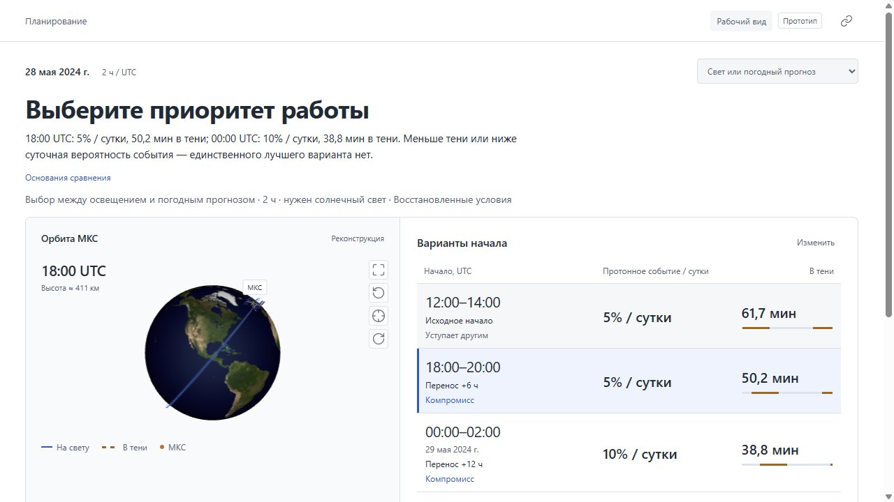
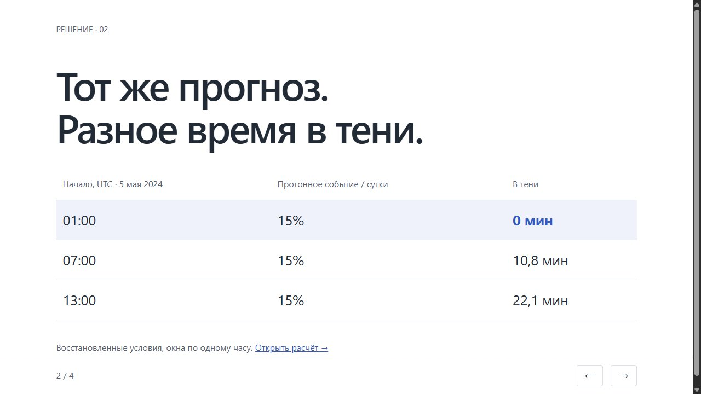

# Изменения по итогам аудита main ad7e800

Версия алгоритма 0.5.0. Цель — сделать выбор понятным при самостоятельном просмотре и подкрепить демонстрацию воспроизводимыми проверками. Таблица разделяет реализованные исправления и то, что требует внешних данных или живого показа. Она не присваивает проекту баллы за будущую защиту.

| Критерий | Что изменено | Проверка и оставшаяся граница |
|---|---|---|
| О1. Задача и факторы | Имя операции, длительность и требование света перед сравнением; показательный случай осмотра | Условие освещения отделено от двух внешних механизмов. Полный исторический каталог сближений не появился |
| О2. Интерпретация | Предмет процента и сутки в заголовке; различаются неизвестная полнота, отсутствие данных и исключение из сравнения | Нет общего выдуманного риска; пропуски не отображаются нулём |
| О3. Сравнение | Решение над сценой, все показатели рядом, уступающие варианты обозначены; отдельные случаи предпочтения и компромисса | Проверки исключения исторической геометрии из replay и роли проигрывающих вариантов |
| О4. Основания | Значение и короткое правило до технических полей; русские названия; таблица сравнения в пояснении | Полные evidence и идентификаторы сохранены; источники открываются из карточки |
| О5. Интерфейс | Однозначная русская дата UTC, имя задачи, результат в истории, компактный экран; режим защиты сохраняет выбор | Проверки дат, перехода суток, ссылок и вывода недоверенного текста |
| О6. Защита | Четыре автономных HTML-слайда, четырёхминутный маршрут с конкретными числами, резервные примеры | Живое выступление и проверка понимания человеком остаются за командой |
| О7. Дополнительные функции | Рассчитанная тень окрашена на траектории; общая временная шкала; заключение в полноэкранной сцене | Не выдаём 3D за отдельную физическую модель. Пользовательское исследование не имитируется |
| Т1. Данные | Отдельная панель здоровья текущих источников и ручное обновление, независимое от сохранённого результата | Пропуски, архивные хеши, устаревшие данные и поздние выпуски покрыты тестами; внешняя доступность меняется |
| Т2. Орбита | Сферическая интерполяция вместо хорды; уточнение границ тени; контроль опубликованного вектора SGP4 | Контроль SGP4 не подтверждает физическую точность исторической орбиты МКС |
| Т3. Методы | Цепочка «источники → собственный расчёт → выбор»; конкретные причины и консервативный минутный допуск освещения | Допуск обоснован численной проверкой; эксплуатационной калибровки нет |
| Т4. Прошлое решение | Понятные названия режимов, отдельные момент выпуска и граница знания, воспроизводимые запросы по дате | Тесты исключают поздние выпуски. Подтверждённого архива публикаций исторических TLE по-прежнему нет |
| Т5. Эксперименты | 36 планов / 108 окон, базовый вариант, улучшения и ухудшения, ошибки сетки, ложные отметки и пропуски | Проверяется освещение одной моделью. Полной разметки погодного события для оценки вероятностей нет |
| Т6. Надёжность | Проверки двух параллельных запросов, отключённых источников и повреждённого пакета | Старые тесты кеша, таймаутов и устаревания сохранены; примеры доступны без сети |
| Т7. Код | Чистые функции представления, отдельный модуль ZIP, проверка хешей, тесты календаря и экранирования | Произвольные URL и пути из записи при экспорте не читаются. Полный аудит безопасности не проводился |
| Т8. Воспроизводимость | Новый venv Python 3.12; обновлённые документы; ZIP включает исходные байты, параметры, версию и зависимости | Публичный адрес и проверка с другого устройства не выполнены; ZIP проверяет сохранённые данные, не гарантирует идентичный новый текущий прогноз |

Основная карта кода: `providers.py` получает и проверяет источники, `orbit.py` рассчитывает положение и тень, `conjunctions.py` восстанавливает геометрию сближений, `analysis.py` оценивает окна и сравнивает, `storage.py` сохраняет снимки, `bundle.py` собирает проверяемый пакет. `static/model.js` формирует представление результатов, `app.js` управляет интерфейсом, `orbit.js` рисует сцену.

Команды проверки: `python -m pytest -q`, `npm test`, `python scripts/validate_planning.py`. Отдельно: `python scripts/verify_bundle.py orbital-risk-evidence.zip`. Проверка набора зависимостей из чистого окружения: инструкции в README. Внешние endpoint фиксированы в коде, API-ключи не нужны; `.env`, базы и виртуальное окружение исключены из Git.

Локальная проверка 19.09.2026: 67 Python-тестов и 17 JavaScript-тестов прошли. В браузере проверены предпочтение, компромисс, новая дата 09.06.2024 09:30 UTC, ввод русской даты, раскрытие оснований, полноэкранное заключение, синхронизация времени сцены и ползунка, состояние источников и переключение слайдов. На ширине 390 px горизонтального переполнения нет; в узкой компоновке сравнение предшествует 3D. Публичный адрес не проверялся.

## Проверенные экраны

