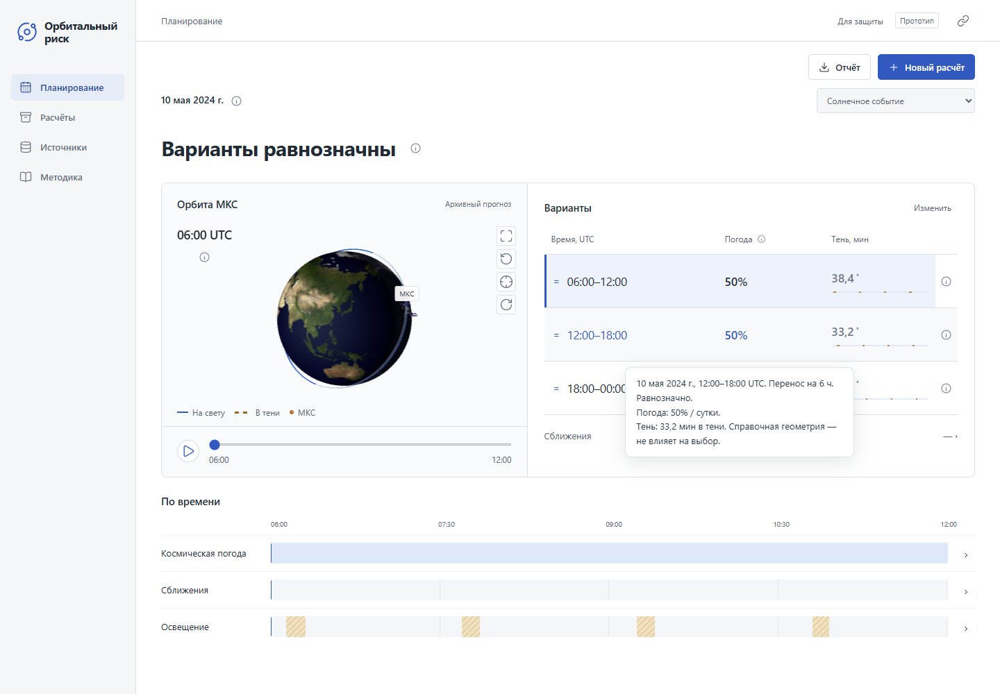
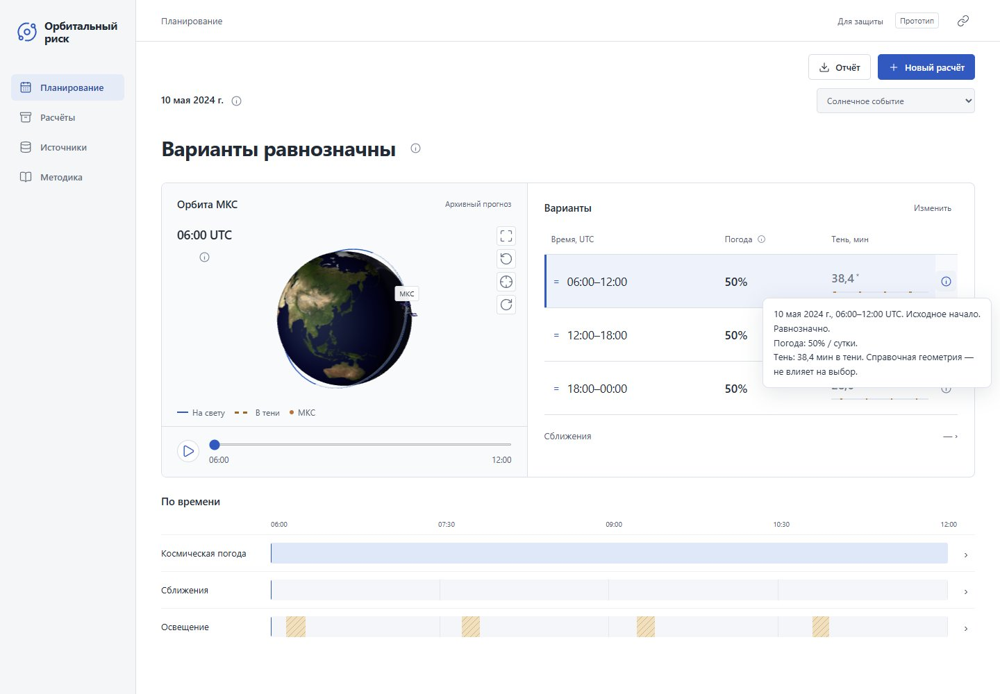

# Компактный интерфейс

В строке варианта остаются время, погодный показатель и минуты тени. Роль варианта обозначена знаком; исходное начало, перенос, единицы прогноза и применимость факторов раскрываются в подсказке. Справочная тень отмечена звёздочкой. Отсутствующий показатель остаётся прочерком, а не превращается в ноль.

Тот же принцип применён к орбите, временным шкалам, архиву, источникам, методике и диалогам. Короткие названия действий и полей остаются видимыми. Объяснения доступны по наведению, фокусу с клавиатуры или нажатию на значок информации. Большие материалы открываются в сворачиваемых разделах: события, источники, метод и ограничения.

Подсказка появляется через 280 мс, допускает перевод указателя на её текст и закрывается по Escape. Нажатие на значок закрепляет подсказку; повторное нажатие закрывает её. Escape сначала закрывает подсказку, сохраняя открытый диалог. Подсказки размещаются над модальными окнами и не выходят за границы экрана. Обычная кнопка сохраняет своё действие.

Кнопки, строки и навигация реагируют на наведение цветом; нажатие сопровождается небольшим уменьшением. Фокус виден отдельно от наведения. Настройка `prefers-reduced-motion` отключает переходы и движение при нажатии.

При наведении подсказка следует за курсором внутри элемента с отступом 16 px. У края экрана она меняет сторону и остаётся в пределах окна. После выхода с элемента положение фиксируется, чтобы можно было перевести указатель на текст. Подсказки, открытые с клавиатуры или нажатием, сохраняют привязку к элементу. Перемещение обновляется через requestAnimationFrame без инерции.

## Снимки

Воспроизведение орбиты обновляется по кадрам: 1 секунда воспроизведения соответствует 5 минутам расчётного времени. Между исходными точками МКС движется по сферической дуге с интерполяцией высоты. Часы показывают секунды; положение МКС, вращение Земли, освещение и курсор временной шкалы используют один момент времени. Это интерполяция для отображения, не дополнительные расчётные точки. Пауза сохраняет дробную позицию, ползунок допускает промежуточные значения. Кнопка информации расположена справа от часов и доступна нажатием.

## Проверка

`npm test`: 18 тестов, включая экранирование текста подсказки. `python -m pytest tests/test_ui_api.py -q`: 3 теста маршрутов и API.

В браузере проверены наведение, клавиатурный фокус, переключение и закрытие подсказок, их работа внутри диалога, выбор окна, раскрытие факторов и методики. При ширине 390 px горизонтального переполнения нет; значок информации открывается нажатием и не меняет выбранное окно. Проверены вычисленные стили при включённом уменьшении движения. Аппаратный сенсорный ввод не тестировался.

Расчётная модель и содержание выгружаемого отчёта не меняются.
